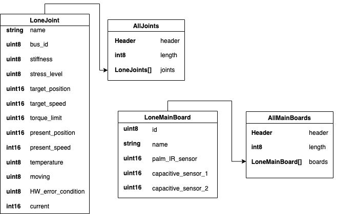
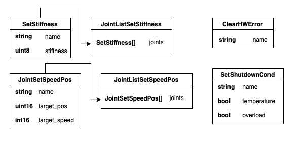

# ros2_robothands

ROS 2 packages for the [Seed Robotics](https://www.seedrobotics.com) RH8D
dexterous hands: hardware driver, in-hand FTS sensors, URDF description, and
Gazebo simulation.

Tested with ROS 2 Jazzy on Ubuntu 24.04.

> **Status**: usable, but still in development. Please report any bugs you
> encounter.

## Packages

| Package | Purpose |
|---|---|
| `seed_hand_driver` | Hardware driver: talks to the hand's motors over serial, publishes state, accepts commands |
| `seed_hand_msgs` | Message definitions for the driver's topics |
| `seed_hand_bringup` | Top-level launch files: driver + optional sensors in one command |
| `ros2_sensor_pkg` | Driver for the in-hand FTS pressure sensors (git submodule, also usable standalone) |
| `seed_rh8d_description` | URDF/xacro model of the RH8D (left and right), meshes, RViz visualization |
| `seed_rh8d_gazebo` | Gazebo (gz-sim) simulation: world, ros2_control configs, sim helper nodes |
| `dynamixel_sdk` | Bundled ROBOTIS Dynamixel SDK Python bindings (the apt package is C++ only) |

`seed_rh8d_description` and `seed_rh8d_gazebo` have their own READMEs with
model and simulation details.

## Installation

```bash
mkdir -p ~/robothands_ws && cd ~/robothands_ws
git clone --recurse-submodules https://github.com/seedrobotics/ros2_robothands.git .
# or: git clone --recurse-submodules git@github.com:seedrobotics/ros2_robothands.git .

source /opt/ros/jazzy/setup.bash
rosdep install --from-paths src --ignore-src -y   # pyserial, numpy, xacro, ...
colcon build --symlink-install
source install/setup.bash                          # repeat in every new terminal
```

For simulation you additionally need `ros-jazzy-ros-gz` and
`ros-jazzy-gz-ros2-control` (kept out of the hard dependencies on purpose).

### Serial port setup

Add yourself to the `dialout` group once (then log out and back in):

```bash
sudo usermod -a -G dialout $USER
```

To reach the full 50 Hz update rate, lower the FTDI latency timer each time
the hand is plugged in (replace `ttyUSB0` with your port):

```bash
echo 1 | sudo tee /sys/bus/usb-serial/devices/ttyUSB0/latency_timer
```

## Running the real hand

1. Edit the config for your hand in `src/seed_hand_driver/config/`
   (`RH8D_R.yaml`, `RH8D_L.yaml`, or `RH8D_RL.yaml` for two hands on one
   port). At minimum set `port`. Parameters:
   - `port` — serial device, e.g. `/dev/ttyUSB0`
   - `baudrate` — must be `1000000`
   - `frequency` — update rate in Hz, 50 maximum
   - `light_mode` — reduced register set for higher rates with two hands on
     one port (disables current, temperature, hardware-error, and main-board
     sensor reading — watch the hand's red LED instead)
   - `prefix` — topic prefix (`R_`, `L_`, or `RL_`)
   - `joint_mapping` — joint name → motor ID (edit only if you changed motor
     IDs; the user samples assume the default names)
2. If using the in-hand sensors, also set the port in
   `src/ros2_sensor_pkg/config/sensors_right.yaml` / `sensors_left.yaml`.
3. Launch:

```bash
ros2 launch seed_hand_bringup hand.launch.py side:=right
ros2 launch seed_hand_bringup hand.launch.py side:=right use_sensors:=true
ros2 launch seed_hand_bringup hand.launch.py side:=both use_sensors:=true
ros2 launch seed_hand_bringup hand.launch.py side:=right rviz:=true motor_gui:=true
```

`rviz:=true` shows the measured hand pose live; `motor_gui:=true` adds the
same motor slider panel as the sim's `gazebo.launch.py` (single sides only,
not `both`).

### Fingertip sensor data

With `use_sensors:=true` the fingertip forces are also republished as
`geometry_msgs/WrenchStamped` on `/rh8d/<side>/fingertip/<finger>/wrench` —
the same topics the Gazebo simulation publishes — stamped in the model's
fingertip frames (add a Wrench display in RViz for live force arrows).
`plot:=true` opens PlotJuggler with a prepared fingertip layout
(`seed_hand_bringup/config/fingertips.xml`, right hand; the layout works
identically against the simulation). The adapter's `force_scale`
(default 0.01) roughly maps raw counts near the newton range — replace it
with the measured counts-per-newton factor once calibrated. If the sensors
are cabled in a different order, adjust the adapter's `finger_order`
parameter.

Two hands on *different* ports: run two launches with `side:=left` and
`side:=right` (each hand needs its own config with its own port).

## Visualization and simulation

```bash
# RViz model inspection with joint sliders (no hardware needed)
ros2 launch seed_rh8d_description display.launch.py side:=right

# Gazebo physics simulation with ros2_control
ros2 launch seed_rh8d_gazebo gazebo.launch.py side:=right
```

See [src/seed_rh8d_description/README.md](src/seed_rh8d_description/README.md)
for xacro arguments, finger-coupling modes, and how to mount the hand on a
larger robot, and
[src/seed_rh8d_description/INTEGRATION.md](src/seed_rh8d_description/INTEGRATION.md)
for simulation gotchas.

## Aligned interface (sim ↔ real)

The real hand and the simulation speak a common interface, started by
default from `hand.launch.py`:

| Topic | Type | Direction |
|---|---|---|
| `motor_commands` | `sensor_msgs/JointState` | command, one entry per motor axis |
| `hand_controller/joint_trajectory` | `trajectory_msgs/JointTrajectory` | command (the sim controller's topic; phalanx or motor-axis names) |
| `motor_states` | `sensor_msgs/JointState` | measured motor positions (real hand) |

Motor axes carry the model's joint names (`r_wrist_rotation_joint`,
`r_index_flexion_joint`, …). **Units**: finger flexion axes take a closure
fraction 0 (open) – 1 (closed); wrist and thumb-abduction axes take radians.
The same command closes the finger in Gazebo and on the real hand:

```bash
ros2 topic pub -1 /motor_commands sensor_msgs/msg/JointState \
  "{name: [r_index_flexion_joint], position: [0.7]}"
```

Visualization and the motor slider panel are flags on `hand.launch.py`
(`rviz:=true motor_gui:=true`, see above); `view.launch.py side:=right
gui:=true` provides the same as a standalone launch for a second machine.

Careful with the slider panel on real hardware: the sliders start at 0 /
centered and command that pose as soon as the panel opens.

> **Calibration**: the tick ↔ unit mapping defaults to the full motor range
> (0–4095) over the full joint range and is **not hardware-calibrated** yet.
> Override `calib.<axis>.tick_min` / `tick_max` parameters of the
> `aligned_interface` node once measured (swap the two values to invert a
> motor's direction).

The legacy tick-based topics below remain unchanged and can be used in
parallel.

## Driver topics

All topic names carry the configured prefix (`R_` below). Message structures:




**Published:**

| Topic | Type | Content |
|---|---|---|
| `R_Joints` | `seed_hand_msgs/AllJoints` | Position, speed, current, temperature, stress level, and error state of every joint |
| `R_Main_Boards` | `seed_hand_msgs/AllMainBoards` | Palm IR distance sensor and capacitive sensors |

**Subscribed:**

| Topic | Type | Action |
|---|---|---|
| `R_speed_position` | `seed_hand_msgs/JointListSetSpeedPos` | Set target position (0–4095) and speed (0–1023, `-1` keeps previous) for several joints at once |
| `R_stiffness` | `seed_hand_msgs/JointListSetStiffness` | Set joint stiffness (1–9, default 8; low values overshoot). Changing stiffness twice requires a power cycle in between |
| `R_clear_error` | `seed_hand_msgs/ClearHWError` | Clear a joint's hardware error (at most once per 30 s per joint) |
| `R_shutdown_condition` | `seed_hand_msgs/SetShutdownCond` | Configure shutdown on overload / overtemperature per joint |

Joints are addressed by name (or numeric ID) as defined in the config's
`joint_mapping`.

## Examples

Runnable scripts in `src/seed_hand_driver/user_samples/` (`_L` variants for
the left hand):

- `user_sample_1_get_values.py` — subscribe and print all joint states
- `user_sample_2_set_speed_position_R.py` — command positions/speeds (opens the hand)
- `user_sample_7_RH8D_R_grab_object.py` — autonomous grab: watches the palm
  IR sensor, closes on an object, stops fingers on current threshold, holds,
  releases

## Troubleshooting

- **Permission denied on the serial port** — add yourself to `dialout` (see
  above).
- **Driver logs `TIME PERIOD EXCEEDED`** — the configured `frequency` is too
  high for the setup; lower it (~30 Hz for two hands on one port) or enable
  `light_mode`.
- **Sensors on the wrong hand** — `hand_polarity` in the sensor YAML must be
  `L_` or `R_` to match the hand the sensors are mounted on.
